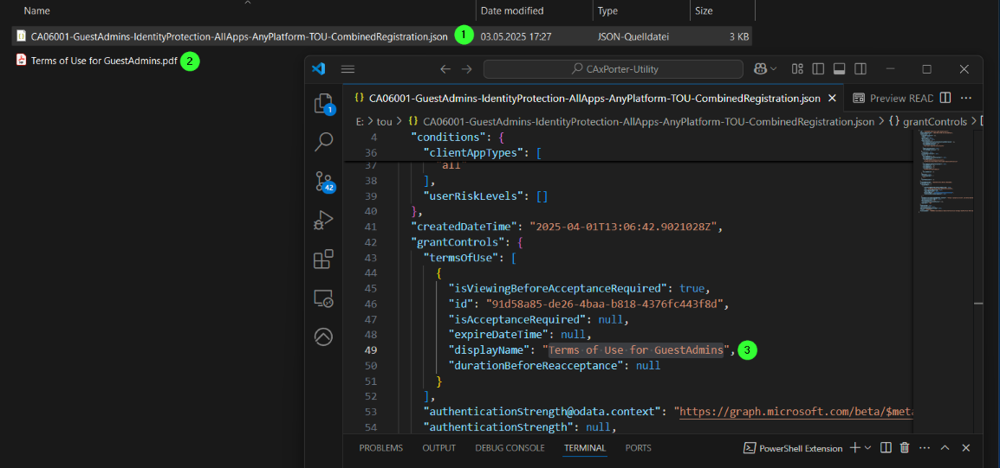
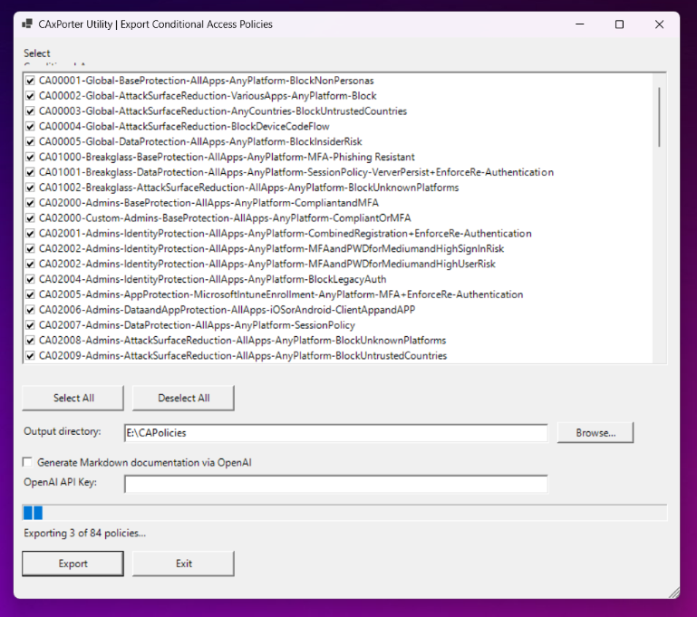
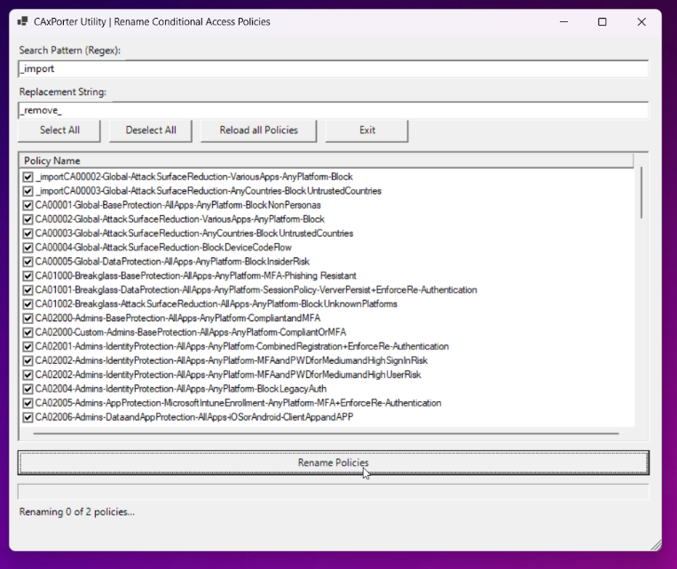

# CAxPorter Utility

A PowerShell-based toolkit to manage Microsoft Entra Conditional Access (CA) policies through a unified graphical interface.

## Overview

**CAxPorter** is a script-driven utility that simplifies the administration of Conditional Access policies in Microsoft Entra ID via GUI or CLI. It offers import, export, documentation, renaming, and deletion functionality for CA policies via Microsoft Graph API.

> Built for IT admins, consultants, and engineers to support consistent, portable, and repeatable Conditional Access policy management workflows.

You can find more detailed information on my blog: www.ctrlaltshiftenter.cloud

---

## Features

### 📂 Centralized GUI Launcher

* Simple main menu to access all modules.
* Uses Windows Forms (WinForms) for a native GUI experience.
* Execute sub-scripts without opening new consoles.


### ✉️ Import CA Policies

* Import Conditional Access policies from exported JSON files.
* GUI-driven file selection.
* Set policy state (enabled, disabled, report-only) and add name prefix.
* Automatically resolves:

  * Users
  * Groups
  * Applications
  * Named Locations
  * Terms of Use
  * Authentication Contexts and Strengths

* Note: If you want to import policies with Terms of Use construction, you have to store a PDF file with the terms of use in the same directory as the policy json. 




### 🗃️ Export CA Policies

* Export existing Conditional Access policies to JSON.
* Optional Markdown documentation generation via OpenAI API.
* Resolves and embeds references to external objects.
* Supports regex or prefix filtering.

> more information on https://platform.openai.com/



### 🏑 Document Policies

* OpenAI for auto-generated policy descriptions.
* Create Markdown documentation from exported JSON object.
* OpenAI API Key and subscription required.
* CLI and GUI support.
* Examples are stored in /examples dir


### 🔄 Rename CA Policies

* Select and rename policies using a regex pattern.
* GUI-based selection and dry-run support.
* Progress bar and feedback included.




### ❌ Delete CA Policies

* Bulk-delete selected Conditional Access policies.
* Uses Graph API (not dependent on local module availability).
* Confirmation dialog and progress feedback included.


---

## Folder Structure

```
|
|-- main.ps1                     # Main launcher script
|-- scripts
|   |-- import
|   |   \-- Import-CAPolicies.ps1
|   |-- export
|   |   \-- Export-CAPolicies.ps1
|   |-- rename
|   |   \-- Rename-CAPolicies.ps1
|   |-- delete
|   |   \-- Delete-CAPolicies.ps1
|   \-- document
|       \-- Document-CAPolicies.ps1
|-- functions                   # functions (e.g. Get-CAPolicies.ps1)
```

---

## Requirements

* Windows PowerShell 7+
* Microsoft Graph PowerShell SDK (installed on demand)
* Permissions to read/write Conditional Access policies.

---

## Usage

### 1. Clone this repository

```bash
git clone https://github.com/PatrickSeltmann/CAxPorter-Utility.git
cd CAxPorter-Utility
```

### 2. Launch the Toolkit

```powershell
.\main.ps1
```

### 3. Follow the GUI to perform import/export/delete/etc.

> Each sub-module also supports CLI mode with specific parameters. See individual `.ps1` files for examples.

---

## License

This project is licensed under the **GNU General Public License v3.0**.

* You are free to use, modify, and distribute this software.
* Commercial use is allowed.
* All modifications and derivative works **must** also be distributed under the GPLv3 license.

See [LICENSE](./LICENSE) for details.

---

## Author

**Patrick Seltmann**
Senior Consultant, Microsoft Security

---

## Contributing

PRs and suggestions are welcome! Please open an issue or submit a pull request if you'd like to improve this toolkit.
